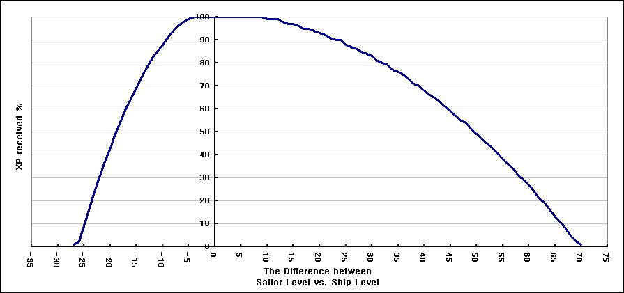

**Note:**
*"Sailor-Ship" indicates the level difference between the sailor and the ship. Negative value indicates that sailor level is lower than the ship level. Positive value indicates that sailor level is higher than the ship level.*  
*"Sailor-Ship"*：水兵等级与船只等级之差
  
| Sailor-Ship | ≤-27 | -26 | -25 | -24 | -23 | -22 | -21 | -20 | -19 | -18 | -17 | -16 | -15 | -14 | -13 | -12 | -11 | -10 | -9 | -8 | -7 | -6 | -5 |
| ----------- | ---- | --- | --- |---- | --- | --- | --- | --- | --- | --- | --- | --- | --- | --- | --- | --- | --- | --- | -- | -- | -- | -- | -- |
| **Exp %** | 1% | 2% | 9% | 17% | 24% | 31% | 37% | 43% | 49% | 55% | 60% | 65% | 69% | 74% | 78% | 82% | 85% | 88% | 91% | 94% | 96% | 98% | 99% |
   
| Sailor-Ship | [-4,10] |
| ----------- | ---- |
| **Exp %** | 100% | 
   
| Sailor-Ship | [11,12] | 13 | [14,15] | 16 | [17,18] | 19 | 20 | 21 | 22 | [23,24] | 25 | 26 | 27 | 28 | 29 | 30 | 31 | 32 | 33 | 34 | 35 | 36 | 37 | 38 | 39 | 40 | 41 | 42 | 43 | 44 | 45 | 46 | 47 | 48 | 49 | 50 | 51 | 52 | 53 | 54 | 55 | 56 | 57 | 58 | 59 | 60 | 61 | 62 | 63 | 64 | 65 | 66 | 67 | 68 | 69 | ≥70 |
| ----------- | ---- | --- | --- |---- | --- | --- | --- | --- | --- | --- | --- | --- | --- | --- | --- | --- | --- | --- | -- | -- | -- | -- | -- | -----| ---| ---| -- | -- | -- | -- | -- | -- | -- | -- | -- | -- | -- | -- | -- | -- | -- | -- | -- | -- | -- | -- | -- | -- | -- | -- | -- | -- | -- | -- | -- | --- |
| **Exp %** | 99% | 98% | 97% | 96% | 95% | 94% | 93% | 92% | 91% | 90% | 88% | 87% | 86% | 85% | 84% | 83% | 81% | 80% | 79% | 77% | 76% | 75% | 73% | 71%|70%| 68%| 66%| 65%| 63%| 61%| 59%| 57%| 55%| 54%| 51%|49%|47%|45%| 43%| 41%| 38%| 36%| 34%| 31%| 29%| 27%| 24%| 21%| 19%| 16%| 13%| 11%| 8% | 5% | 2% | 1% |  

  
Source: trainworld.us

**Experience Chart 经验表**
| Lvl | Exp to next Level |
| 等级 | 下一级所需经验  |
| 1| 150 |
